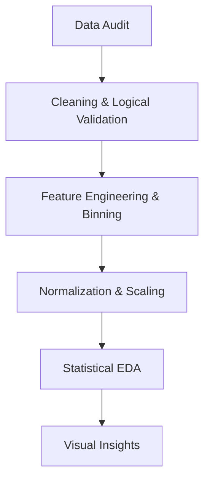

# 📊 **Customer Subscription Churn and Usage Pattern Analysis**

## **Group Number:** 06
### **Members:**

* **Shreya Waghmode**,
  PRN: 25070123159

* **Kahaan Shah**,
  PRN: 25070123060

---

## 📌 Overview

This project focuses on analyzing customer subscription data to understand usage behavior and identify patterns that lead to customer churn. Exploratory Data Analysis (EDA) techniques are used to extract insights and support data-driven decision-making.

---

## 🎯 Aim

To perform exploratory data analysis on customer subscription data and identify key factors influencing churn.

---

## 🎯 Objectives

* Analyze customer usage patterns
* Identify factors affecting customer churn
* Perform data cleaning and preprocessing
* Visualize trends and relationships
* Generate meaningful insights

## Executive Summary

This project explores the behavioral and financial triggers that lead to customer attrition (churn). By analyzing a dataset of **2,800 users**, we applied rigorous statistical methods and visual encoding to identify why users stop subscribing and how the business can intervene.

-----

## The Data Science Pipeline

The analysis followed a logical progression from raw data to actionable intelligence:

-----

## Theoretical Foundations

### 1\. Data Cleaning & Integrity

  * **Missing Value Imputation:** We utilized **Mean Imputation** for numerical variables. Theoretically, this maintains the central tendency of the dataset without reducing the sample size.
  * **Logical Constraint Checking:** We audited the relationship between `Tenure` and `Last Login`. Records where "Time since last login" exceeded "Total Tenure" were removed as they represented data entry errors.

### 2\. Normalization Theory

To ensure all features contributed equally to the analysis, we applied two types of scaling:

  * **Standard Scaling (Z-Score):** $z = \frac{x - \mu}{\sigma}$. Used for `Weekly Usage` to center data around a mean of 0.
  * **Robust Scaling:** Used for `Support Tickets`. By utilizing the **Median** and **IQR**, this method ensures that outliers (extreme support seekers) do not skew the overall distribution.

### 3\. Visual Encoding & Statistical Logic

  * **Kernel Density Estimation (KDE):** Used to visualize the probability density of usage. It provides a smooth curve that reveals the "peaks" of user activity.
  * **Correlation Heatmaps:** Calculated using the **Pearson Correlation Coefficient** ($r$) to identify linear relationships between monthly fees, usage hours, and churn.
  * **Boxplots:** Employed the **1.5x IQR Rule** to detect anomalies in payment history and usage.

-----

## 🔍 Key Discoveries

### Statistical Snapshot

| Feature | Min | Max | Avg | Theory Applied |
| :--- | :--- | :--- | :--- | :--- |
| **Monthly Fee** | 199.0 | 699.0 | 434.21 | Price Sensitivity Analysis |
| **Weekly Usage** | 0.5 hrs | 25.0 hrs | 12.89 hrs | Engagement Metric |
| **Tenure** | 1.0 mo | 36.0 mo | 18.61 mo | Customer Lifecycle Stage |

### 💡 Core Insights

1.  **The Inactivity Threshold:** Customers with **Low Usage** (\< 5 hours/week) show a churn probability of **\~65.95%**. Inactivity is the strongest lead indicator of cancellation.
2.  **Payment Friction:** Churn rates skyrocket following **Payment Failures**, suggesting that technical or financial friction often overrides brand loyalty.
3.  **The "Newbie" Risk:** Users in the **0-12 month tenure bin** are significantly more likely to churn than veteran users (25+ months), identifying a need for better onboarding.

-----

## Step-by-Step Implementation

### Step 1: Pre-processing

  * Handled missing values and removed duplicates.
  * Performed **Feature Binning** (e.g., converting continuous hours into "Low", "Medium", "High" categories).

### Step 2: Univariate & Bivariate Analysis

  * Analyzed the distribution of `Plan Types` (Basic vs. Premium).
  * Compared `Churn vs. Non-Churn` groups across all numerical variables using GroupBy aggregates.

### Step 3: Advanced Visualization

  * **Violin Plots:** To see the density of usage hours across different plans.
  * **Stacked Bar Charts:** To visualize the proportion of churn within different tenure groups.

-----

## Conclusion

The project successfully maps the journey of a "Churn-prone" customer: **Low engagement ➡️ Payment issues ➡️ Inactivity ➡️ Cancellation.** **Business Recommendation:** Implement a "Red Flag" system for users whose weekly usage drops by 30% or more, particularly within their first year of subscription.

-----

