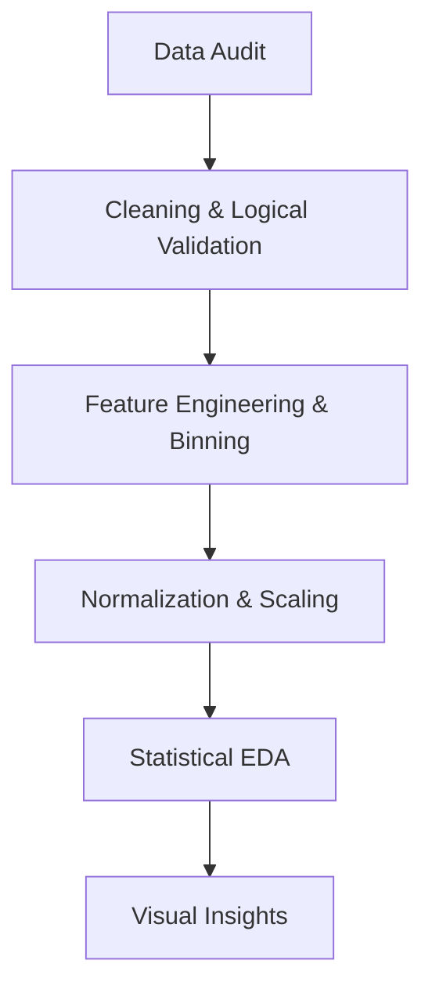

# 📊 Customer Subscription Churn and Usage Pattern Analysis

## 👥 Group Details

**Group Number:** 06

### Members:

* **Shreya Waghmode**
  PRN: 25070123159

* **Kahaan Shah**
  PRN: 25070123060

---

# 📌 Overview

This project focuses on analyzing customer subscription data to understand usage behavior and identify patterns that lead to customer churn. Using Exploratory Data Analysis (EDA) techniques and statistical visualization, the study uncovers behavioral indicators that signal customer disengagement and eventual subscription cancellation. The insights generated support proactive business strategies aimed at improving customer retention and enhancing long-term revenue stability.

---

# 🎯 Aim

To perform exploratory data analysis on customer subscription data and identify key factors influencing customer churn.

---

# 🎯 Objectives

* Analyze customer usage patterns
* Identify factors affecting customer churn
* Perform data cleaning and preprocessing
* Visualize trends and relationships
* Generate meaningful insights
* Develop actionable recommendations for customer retention

---

# 📂 Dataset Description

| Feature Name               | Data Type   | Description                                 |
| -------------------------- | ----------- | ------------------------------------------- |
| **user_id**                | Integer     | Unique identifier for each customer         |
| **signup_date**            | Date        | Date when the customer subscribed           |
| **plan_type**              | Categorical | Type of subscription plan (Basic/Premium)   |
| **monthly_fee**            | Numeric     | Monthly subscription cost                   |
| **avg_weekly_usage_hours** | Numeric     | Average weekly usage time                   |
| **support_tickets**        | Numeric     | Number of customer support requests         |
| **payment_failures**       | Numeric     | Number of failed payment attempts           |
| **tenure_months**          | Numeric     | Total subscription duration                 |
| **last_login_days_ago**    | Numeric     | Days since last login                       |
| **churn**                  | Categorical | Indicates whether customer churned (Yes/No) |

### Dataset Summary

| Attribute       | Value                      |
| --------------- | -------------------------- |
| Total Records   | **2800**                   |
| Total Features  | **10**                     |
| Target Variable | **Churn**                  |
| Dataset Type    | Customer Subscription Data |

---

# 🧰 Tech Stack Used

| Category                | Tools & Libraries   |
| ----------------------- | ------------------- |
| Programming Language    | Python              |
| Data Processing         | Pandas, NumPy       |
| Visualization           | Matplotlib, Seaborn |
| Statistical Analysis    | SciPy, NumPy        |
| Development Environment | Jupyter Notebook    |
| Version Control         | Git & GitHub        |

---

# 📊 Executive Summary

This project explores the behavioral and financial triggers that lead to customer attrition (churn). By analyzing a dataset of **2,800 users**, we applied rigorous statistical methods and visual encoding to identify why users stop subscribing and how businesses can intervene early. The analysis demonstrates that churn is typically preceded by declining engagement and transactional friction rather than sudden cancellation.

---

# 🔄 The Data Science Pipeline

---

# 📚 Theoretical Foundations

## 1️⃣ Data Cleaning & Integrity

* **Missing Value Imputation:**
  Mean Imputation was applied to maintain the central tendency of numerical features without reducing sample size.

* **Logical Constraint Checking:**
  Records violating logical relationships (e.g., Last Login exceeding Tenure) were removed to ensure dataset integrity.

---

## 2️⃣ Normalization Theory

Two normalization methods were applied:

### Standard Scaling (Z-Score)

Used to standardize usage-related features.

[
z = \frac{x - \mu}{\sigma}
]

### Robust Scaling

Used for support-related variables using Median and IQR to reduce the impact of outliers.

---

## 3️⃣ Visual Encoding & Statistical Logic

* **Kernel Density Estimation (KDE)**
  Used to visualize probability distribution of user activity.

* **Correlation Heatmaps**
  Pearson Correlation Coefficient used to detect linear relationships.

* **Boxplots**
  Applied 1.5 × IQR rule to detect anomalies.

---

# ⚙️ Step-by-Step Implementation

## Step 1: Pre-processing

* Removed duplicate records
* Handled missing values
* Validated logical relationships
* Performed feature binning (Low, Medium, High usage groups)

---

## Step 2: Univariate & Bivariate Analysis

* Analyzed distribution of subscription plans
* Compared churn vs non-churn users
* Evaluated monthly fee and engagement patterns

---

## Step 3: Advanced Visualization

* **Violin Plots** — Usage distribution across plans
* **Stacked Bar Charts** — Churn proportion by tenure
* **Heatmaps** — Feature correlations
* **Density Plots** — Behavioral activity patterns

---

# 📈 Statistical Snapshot

| Feature      | Min     | Max      | Avg       | Theory Applied     |
| ------------ | ------- | -------- | --------- | ------------------ |
| Monthly Fee  | 199.0   | 699.0    | 434.21    | Price Sensitivity  |
| Weekly Usage | 0.5 hrs | 25.0 hrs | 12.89 hrs | Engagement Metric  |
| Tenure       | 1 mo    | 36 mo    | 18.61 mo  | Customer Lifecycle |

---

# 🔍 Key Findings

| Finding No. | Observation                                                            | Business Meaning                            |
| ----------- | ---------------------------------------------------------------------- | ------------------------------------------- |
| **1**       | Customers using **<5 hrs/week** show **~65.95% churn risk**            | Low engagement is strongest churn predictor |
| **2**       | Multiple **payment failures** significantly increase churn probability | Payment friction impacts retention          |
| **3**       | Users in **0–12 month tenure** churn more frequently                   | Early-stage customers need attention        |
| **4**       | **30% drop in weekly usage** predicts churn risk                       | Early warning system possible               |
| **5**       | Higher support tickets correlate with dissatisfaction                  | Indicates service experience issues         |

---

# 💡 Core Business Insights

1. Customer churn is primarily driven by **reduced engagement** rather than pricing alone.
2. **Payment-related friction** acts as a major catalyst for subscription cancellation.
3. Early-stage users represent the **highest churn risk segment**.
4. Behavioral tracking can significantly improve retention outcomes.

---

# 🧠 Conclusion

The project successfully models the behavioral journey of a churn-prone customer, revealing a clear progression from declining engagement to payment-related issues, followed by inactivity and eventual subscription cancellation. The analysis highlights that customer churn is typically a gradual process influenced by reduced usage and unresolved transactional challenges rather than a sudden event. By identifying early warning indicators—particularly a weekly usage drop of 30% or more within the first year of subscription—the study emphasizes the importance of proactive monitoring systems. It is therefore recommended that businesses implement an automated "Red Flag" mechanism to detect such behavioral changes and trigger timely retention strategies such as personalized reminders, customer support outreach, or targeted incentives. Implementing these measures can significantly improve customer retention, enhance user satisfaction, and contribute to long-term business stability and revenue growth.

---

