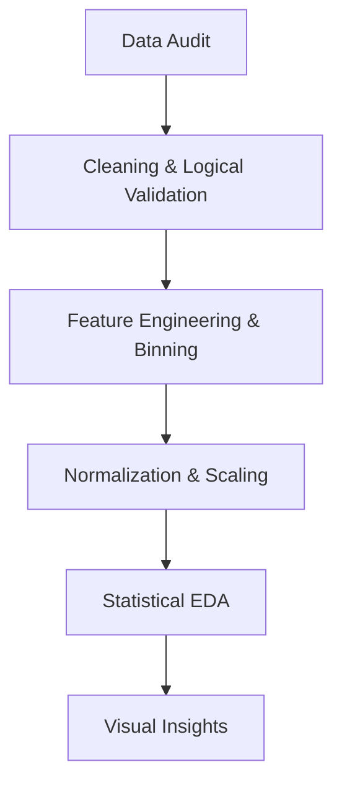

# 📊 Customer Subscription Churn and Usage Pattern Analysis

---

# 👥 Group Details

**Group Number:** 06

### Members:

* **Shreya Waghmode**
  PRN: 25070123159

* **Kahaan Shah**
  PRN: 25070123060

---

# 📌 Overview

This project focuses on analyzing customer subscription data to understand usage behavior and identify patterns that lead to customer churn. Using Exploratory Data Analysis (EDA) techniques and statistical visualization methods, the study uncovers behavioral indicators that signal customer disengagement and eventual subscription cancellation. The insights generated support proactive business strategies aimed at improving customer retention and enhancing long-term revenue stability.

---

# 🎯 Aim

To perform exploratory data analysis on customer subscription data and identify key factors influencing customer churn.

---

# 🎯 Objectives

* Analyze customer usage patterns
* Identify factors affecting customer churn
* Perform data cleaning and preprocessing
* Visualize trends and relationships
* Generate meaningful insights
* Develop actionable recommendations for customer retention

---

# 📂 Dataset Description

| Feature Name               | Data Type   | Description                                 |
| -------------------------- | ----------- | ------------------------------------------- |
| **user_id**                | Integer     | Unique identifier for each customer         |
| **signup_date**            | Date        | Date when the customer subscribed           |
| **plan_type**              | Categorical | Type of subscription plan (Basic/Premium)   |
| **monthly_fee**            | Numeric     | Monthly subscription cost                   |
| **avg_weekly_usage_hours** | Numeric     | Average weekly usage time                   |
| **support_tickets**        | Numeric     | Number of customer support requests         |
| **payment_failures**       | Numeric     | Number of failed payment attempts           |
| **tenure_months**          | Numeric     | Total subscription duration                 |
| **last_login_days_ago**    | Numeric     | Days since last login                       |
| **churn**                  | Categorical | Indicates whether customer churned (Yes/No) |

---

## Dataset Summary

| Attribute       | Value                         |
| --------------- | ----------------------------- |
| Total Records   | **2800**                      |
| Total Features  | **10**                        |
| Target Variable | **Churn**                     |
| Dataset Type    | Customer Subscription Dataset |

---

# 🧰 Tech Stack Used

| Category                | Tools & Libraries   |
| ----------------------- | ------------------- |
| Programming Language    | Python              |
| Data Processing         | Pandas, NumPy       |
| Visualization           | Matplotlib, Seaborn |
| Statistical Methods     | NumPy, SciPy        |
| Development Environment | Jupyter Notebook    |
| Version Control         | Git & GitHub        |

---

# 📊 Executive Summary

This project explores the behavioral and financial triggers that lead to customer attrition (churn). By analyzing a dataset of **2,800 users**, we applied statistical preprocessing techniques and visualization strategies to understand why customers discontinue subscriptions. The analysis demonstrates that churn is typically preceded by declining engagement and transactional friction rather than sudden cancellation, allowing organizations to design preventive retention systems.

---

# 🔄 The Data Science Pipeline



---

# 📚 Theoretical Foundations

This project is grounded in statistical preprocessing, normalization theory, feature engineering principles, and visual analytics methods that ensure reliable interpretation of customer behavior patterns.

---

# 1️⃣ Data Cleaning & Integrity

## Missing Value Imputation

Missing numerical values were handled using **Mean Imputation**:

```
x̄ = ( Σ xi ) / n
```

Where:

* x̄ = Mean value
* xi = Individual observations
* n = Number of observations

**Theory:**
Mean imputation maintains dataset size while preserving central tendency.

---

## Logical Constraint Checking

Data consistency was validated using logical conditions:

```
Last Login Days Ago ≤ Tenure Months × 30
```

Invalid records violating logical relationships were removed.

**Theory:**
This ensures realistic behavior patterns and prevents incorrect model interpretation.

---

# 2️⃣ Normalization Theory

Normalization ensures that variables measured on different scales contribute equally during analysis.

---

## 🔹 Standard Scaling (Z-Score Normalization)

Applied to:

* Weekly Usage
* Monthly Fees

Formula:

```
z = ( x − μ ) / σ
```

Where:

* z = Standardized value
* x = Original value
* μ = Mean
* σ = Standard deviation

### Theoretical Importance

Standard scaling:

* Centers data at mean = 0
* Sets standard deviation = 1
* Improves comparability between features
* Supports stable statistical calculations

---

## 🔹 Robust Scaling

Used when data contains **outliers**.

Formula:

```
x_scaled = ( x − Median ) / IQR
```

Where:

```
IQR = Q3 − Q1
```

* Q1 = First Quartile
* Q3 = Third Quartile

### Theoretical Importance

Robust scaling:

* Minimizes influence of extreme values
* Maintains realistic distribution shape
* Prevents distortion from abnormal usage behavior

---

# 3️⃣ Feature Engineering Theory

Feature engineering improves interpretation and visualization clarity.

---

## Feature Binning

Continuous values were grouped into meaningful categories.

| Weekly Usage | Category |
| ------------ | -------- |
| 0–5 hrs      | Low      |
| 5–15 hrs     | Medium   |
| 15+ hrs      | High     |

**Theory:**

Feature binning:

* Simplifies behavioral interpretation
* Identifies threshold-based risk groups
* Improves categorical comparison

---

# 4️⃣ Visual Encoding & Statistical Logic

Statistical visualization techniques were applied to represent relationships accurately.

---

## Kernel Density Estimation (KDE)

```
f(x) = (1 / nh) Σ K( (x − xi) / h )
```

**Theory:**

KDE:

* Smooths probability distributions
* Reveals activity peaks
* Identifies usage clusters

---

## Pearson Correlation Coefficient

```
r = Σ[(xi − x̄)(yi − ȳ)] /
    √[ Σ(xi − x̄)² Σ(yi − ȳ)² ]
```

**Interpretation**

| Value | Meaning                      |
| ----- | ---------------------------- |
| +1    | Strong Positive Relationship |
| 0     | No Relationship              |
| -1    | Strong Negative Relationship |

---

## Boxplot Outlier Detection

Outliers were detected using:

```
Lower Bound = Q1 − 1.5 × IQR
Upper Bound = Q3 + 1.5 × IQR
```

---

# ⚙️ Step-by-Step Implementation

---

## Step 1: Pre-processing

* Removed duplicate records
* Handled missing values
* Validated logical relationships
* Performed feature binning
* Converted categorical values

---

## Step 2: Univariate & Bivariate Analysis

* Studied individual variable distributions
* Compared churn vs non-churn users
* Evaluated relationships between tenure, usage, and payment patterns

---

## Step 3: Advanced Visualization

* Violin Plots — Usage density comparison
* Stacked Bar Charts — Churn proportion analysis
* Heatmaps — Feature relationships
* KDE Plots — Distribution smoothing

---

# 📈 Statistical Snapshot

| Feature      | Min     | Max      | Avg       | Theory Applied     |
| ------------ | ------- | -------- | --------- | ------------------ |
| Monthly Fee  | 199.0   | 699.0    | 434.21    | Price Sensitivity  |
| Weekly Usage | 0.5 hrs | 25.0 hrs | 12.89 hrs | Engagement Metric  |
| Tenure       | 1 mo    | 36 mo    | 18.61 mo  | Customer Lifecycle |

---

# 🔍 Key Findings

| Finding No. | Observation                                                 | Business Meaning                            |
| ----------- | ----------------------------------------------------------- | ------------------------------------------- |
| **1**       | Customers using **<5 hrs/week** show **~65.95% churn risk** | Low engagement is strongest churn predictor |
| **2**       | Payment failures significantly increase churn               | Payment friction impacts loyalty            |
| **3**       | Users in **0–12 months tenure** churn more                  | New customers need attention                |
| **4**       | **30% drop in usage** predicts churn risk                   | Early warning indicator                     |
| **5**       | High support tickets correlate with dissatisfaction         | Service quality influences retention        |

---

# 💡 Core Business Insights

1. Reduced usage is the primary indicator of customer disengagement.
2. Payment issues act as a catalyst for subscription cancellation.
3. Early-stage users are highly vulnerable to churn.
4. Behavioral tracking enables proactive retention strategies.

---

# 🧠 Conclusion

The project successfully models the behavioral journey of a churn-prone customer, revealing a clear progression from declining engagement to payment-related issues, followed by inactivity and eventual subscription cancellation. The analysis highlights that customer churn is typically a gradual process influenced by reduced usage and unresolved transactional challenges rather than a sudden event. By identifying early warning indicators—particularly a weekly usage drop of 30% or more within the first year of subscription—the study emphasizes the importance of proactive monitoring systems. It is therefore recommended that businesses implement an automated "Red Flag" mechanism to detect such behavioral changes and trigger timely retention strategies such as personalized reminders, customer support outreach, or targeted incentives. Implementing these measures can significantly improve customer retention, enhance user satisfaction, and contribute to long-term business stability and revenue growth.

---
